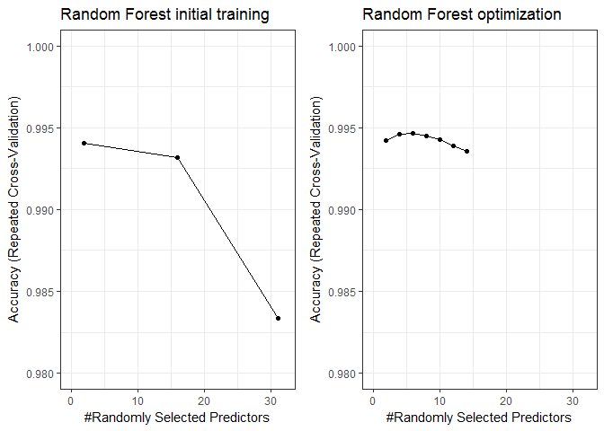

# Weight Lifting Exercise Classification
Holzmeister  
June 18, 2017  

### Synopsis
The goal of this assignment is to classify 20 test dumbell exercises (biceps curl) 
in terms of execution. For this, a test dataset is used which contains several repetitions 
of each of the 5 possible classes of execution performed by six subjects. The execution
of the exercises is observed with four sensors at belt, arm, forearm and dumbbell, with
each measuring multiple observables. 
First, the number of features per observation is reduced from 160 to 31 based on pair-wise
correlation between features and predominately empty columns. After a simple 
classification tree approach failed, a random forest was used to classify with
>99% accuracy and resulted in 20/20 correct assignments in the test dataset.


```r
library(dplyr)
library(reshape2)
library(ggplot2)
library(grid)
library(gridExtra)
library(corrplot)
library(caret)
library(randomForest)
library(rpart)
```


## Data Processing

### Data Download and Import

The URL of the training and test dataset was provided by the Coursera assignmnet.
The data stem from the *Weight lifting exercise dataset* [1]


```r
setwd("C:/Users/Phil/gitreps/WeightLiftingExercise")
fileURLTrain<-"https://d396qusza40orc.cloudfront.net/predmachlearn/pml-training.csv"
fileURLTest<-"https://d396qusza40orc.cloudfront.net/predmachlearn/pml-testing.csv"
download.file(url=fileURLTrain, destfile="training.csv", method="curl")
download.file(url=fileURLTest, destfile="testing.csv", method="curl")
training <- read.csv("./training.csv")
testing <- read.csv("./testing.csv")
```

### Data exploration

The type of execution is stored in the *classe* column of the training set. A brief
comparison of column names identifies this as the only column which differs
between the training and testing dataset.


```r
coldiff<-which(names(training)!=names(testing))
names(training)[coldiff]; names(testing)[coldiff]
```

```
## [1] "classe"
```

```
## [1] "problem_id"
```

A glimpse at the testing data frame revealed that many observations are *NA* for all
20 cases to be tested. These are the columns containing aggregated data of each sensor
(names starting with max, min, ...), which in the training set is provided for various 
*time windows* in rows with $new_window=yes$. For example, we look at the number of 
*NA/NULL/empty* values for all values related to the belt sensor:


```r
dim(training)
```

```
## [1] 19622   160
```

```r
sapply(training[,grep("belt", names(training))], function(y) 
        sum(length(which(is.na(y)|is.null(y)|(y=="")))))
```

```
##            roll_belt           pitch_belt             yaw_belt 
##                    0                    0                    0 
##     total_accel_belt   kurtosis_roll_belt  kurtosis_picth_belt 
##                    0                19216                19216 
##    kurtosis_yaw_belt   skewness_roll_belt skewness_roll_belt.1 
##                19216                19216                19216 
##    skewness_yaw_belt        max_roll_belt       max_picth_belt 
##                19216                19216                19216 
##         max_yaw_belt        min_roll_belt       min_pitch_belt 
##                19216                19216                19216 
##         min_yaw_belt  amplitude_roll_belt amplitude_pitch_belt 
##                19216                19216                19216 
##   amplitude_yaw_belt var_total_accel_belt        avg_roll_belt 
##                19216                19216                19216 
##     stddev_roll_belt        var_roll_belt       avg_pitch_belt 
##                19216                19216                19216 
##    stddev_pitch_belt       var_pitch_belt         avg_yaw_belt 
##                19216                19216                19216 
##      stddev_yaw_belt         var_yaw_belt         gyros_belt_x 
##                19216                19216                    0 
##         gyros_belt_y         gyros_belt_z         accel_belt_x 
##                    0                    0                    0 
##         accel_belt_y         accel_belt_z        magnet_belt_x 
##                    0                    0                    0 
##        magnet_belt_y        magnet_belt_z 
##                    0                    0
```

Compared to the total number of training observations (19622), these summary information are only provided
in ~2.1% of observations and not a single time in the testing set. Therefore, all these
columns are dropped for building the model. In addition, the first 7 columns which identify
the subjects, timing, etc.. are also removed since they are not related to the execution of the
exercise.


```r
rmv<-grep("max|min|amplitude|kurtosis|skewness|var|avg|stddev", names(training))
trClean<-training[,-rmv]
names(trClean[,1:7])
```

```
## [1] "X"                    "user_name"            "raw_timestamp_part_1"
## [4] "raw_timestamp_part_2" "cvtd_timestamp"       "new_window"          
## [7] "num_window"
```

```r
# removed columns of observation ID
trClean<-trClean[,-(1:7)]
paste("reduced colums: ", dim(trClean)[2], "||remaining NA in data frame: ", sum(is.na(trClean)))
```

```
## [1] "reduced colums:  53 ||remaining NA in data frame:  0"
```

Now, we are left with 53 columns, consisting of 13 measured features for each of the 4 sensors, 
plus the classification label in column *classe*.

Next we look at pairwise correlation between the remaining columns and remove those with
absolute correlation >0.75 to reduce both bias and lateron computation time.


```r
corrMat<-cor(trClean%>%select(-classe))
toDrop<-findCorrelation(corrMat, cutoff = 0.75, verbose = FALSE, exact=TRUE)
names(trClean[,toDrop])
```

```
##  [1] "accel_belt_z"      "roll_belt"         "accel_belt_y"     
##  [4] "accel_arm_y"       "total_accel_belt"  "accel_dumbbell_z" 
##  [7] "accel_belt_x"      "pitch_belt"        "magnet_dumbbell_x"
## [10] "accel_dumbbell_y"  "magnet_dumbbell_y" "accel_arm_x"      
## [13] "accel_dumbbell_x"  "accel_arm_z"       "magnet_arm_y"     
## [16] "magnet_belt_z"     "accel_forearm_y"   "gyros_forearm_y"  
## [19] "gyros_dumbbell_x"  "gyros_dumbbell_z"  "gyros_arm_x"
```

```r
trClean<-trClean[,-toDrop]
paste("reduced colums: ", dim(trClean)[2])
```

```
## [1] "reduced colums:  32"
```

The final step before we start training is to check whether there is some extreme
imbalance between the classes in the training set, which could create unwanted bias.

```r
trClean%>%count(classe) 
```

```
## # A tibble: 5 x 2
##   classe     n
##   <fctr> <int>
## 1      A  5580
## 2      B  3797
## 3      C  3422
## 4      D  3216
## 5      E  3607
```
While there is a focus on class A (i.e. correct execution), the differences 
between the classes are not too extreme.

## Training
### First test at classifier training
The first try is a fairly simple classification tree from the *rpart* package. It's
fast and gives a first idea of how complicated the task will end up being.
We train the model with 10-fold crossvalidation, repeated 3 times.


```r
set.seed(42)
Control<-trainControl(method = "repeatedcv", number = 10, repeats = 3)
CARTmodel <- train(classe ~ ., data=trClean, method="rpart2",
                   trControl=Control)
CARTmodel$results
```

```
##   maxdepth  Accuracy     Kappa AccuracySD    KappaSD
## 1        6 0.5032444 0.3774543 0.01058854 0.01293912
## 2        7 0.5248533 0.4022826 0.01092389 0.01346807
## 3        8 0.6290747 0.5347407 0.01286727 0.01571311
```

The accuracy of this classifier (62.9%) is absolutely not sufficient for our purposes.
Checking the publication associated with the dataset [1], we see that the authors
used a random forest approach with accuracy >98%, so this is what we test next.

### Training of a random forest model
Random Forests are similar to the Bagging (bootstrap aggregation) approach, where 
mulitple classifcation trees are grown based on a resampled data set
with replacement in order to decorrelate the individual trees. In addition to this, random 
forest randomly select features available for splitting at each node in order to 
further reduce the correlation between trees. Here, an algorithm of the randomForest package
is used with the default values of ntree=500, automated tuning of the mtry parameter (number
of randomly selected features) and again 10-fold crossvalitation with 3 repetitions. 


```r
set.seed(42)
if(!file.exists("model.rds")){
        controlRF <- trainControl(method="repeatedcv", number = 10, repeats = 3, 
                                  verboseIter = FALSE)
        RFmodel <- train(classe ~ ., data=trClean, method="rf",
                          trControl=controlRF)
        saveRDS(RFmodel, "model.rds")
} else {
        RFmodel<-readRDS(file="model.rds")
}
RFmodel$results
```

```
##   mtry  Accuracy     Kappa  AccuracySD     KappaSD
## 1    2 0.9940546 0.9924791 0.001869651 0.002365099
## 2   16 0.9932052 0.9914048 0.002158878 0.002731220
## 3   31 0.9833692 0.9789628 0.003109507 0.003933124
```

This already looks much better and works nicely for the default search! 
But let's look a bit closer between mtry=2 and mtry=16 and check whther 
we can improve the accuracy further:


```r
set.seed(42)
if(!file.exists("model2.rds")){
        controlRF2 <- trainControl(method="repeatedcv", number = 10, repeats = 3, 
                                  verboseIter = TRUE, search = "grid")
        tunegrid <- expand.grid(.mtry=seq(2,14,2))
        RFmodel2 <- train(classe ~ ., data=trClean, method="rf",
                          trControl=controlRF2, tuneGrid=tunegrid)
        saveRDS(RFmodel2, "model2.rds")
} else {
        RFmodel2<-readRDS(file="model2.rds")
}
RFmodel2$final
```

```
## 
## Call:
##  randomForest(x = x, y = y, mtry = param$mtry) 
##                Type of random forest: classification
##                      Number of trees: 500
## No. of variables tried at each split: 6
## 
##         OOB estimate of  error rate: 0.47%
## Confusion matrix:
##      A    B    C    D    E  class.error
## A 5575    5    0    0    0 0.0008960573
## B   11 3776    8    0    2 0.0055306821
## C    0   14 3393   15    0 0.0084745763
## D    0    0   25 3186    5 0.0093283582
## E    0    0    3    4 3600 0.0019406709
```

We plot both training results for comparison:


```r
p1<-ggplot(RFmodel)+theme_bw()+xlim(0, 32)+ylim(0.98, 1.00)+
        ggtitle("Random Forest initial training")
p2<-ggplot(RFmodel2)+theme_bw()+xlim(0, 32)+ylim(0.98, 1.00)+
        ggtitle("Random Forest optimization")
grid.arrange(p1, p2, ncol=2)
```

<!-- -->

There is only some minor improvement, but it still is an improvement. Some additional
things to check might be training with a different number of trees per forest, training
with different seeds and comparison to other classifications methods. For our purpose
right now, we are content with the classifiers we have.

## Classification of test dataset
### Preprocessing of data
We use the same procedure of column removal as for the training datset

```r
# remove aggregation columns
testClean<-testing[,-rmv]
# removed columns of observation ID
testClean<-testClean[,-(1:7)]
# remove high correlation columns
testClean<-testClean[,-toDrop]
# remove the problem ID (replaces the classe column in the training set)
testClean<-testClean%>%select(-c(problem_id))
```

### Prediction
We predict with both random forest model and the first simple classification tree,
then we compare the results.

```r
pred1<-predict(RFmodel, testClean)
pred2<-predict(RFmodel2, testClean)
paste("Differenced between random forest models: ",sum(!(pred1==pred2)),
      " of 20 cases")
```

```
## [1] "Differenced between random forest models:  0  of 20 cases"
```

```r
pred0<-predict(CARTmodel, testClean)
paste("Differenced between simple tree and random forest models: ",sum(!(pred0==pred2)),
      " of 20 cases")
```

```
## [1] "Differenced between simple tree and random forest models:  14  of 20 cases"
```
Comparing both the first and the second random forest, we observe no difference
in the predicted classes. The initial simple classification tree on the other hand,
differed in 14 of 20 cases.

The model I finally used, was the refined random forest model (RFmodel2). The results
gave 20/20 correct answers in the final quiz.


[1] Velloso, E.; Bulling, A.; Gellersen, H.; Ugulino, W.; Fuks, H. Qualitative Activity Recognition of Weight Lifting Exercises. Proceedings of 4th International Conference in Cooperation with SIGCHI (Augmented Human '13) . Stuttgart, Germany: ACM SIGCHI, 2013. *http://groupware.les.inf.puc-rio.br/har* 
